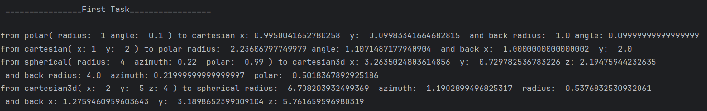
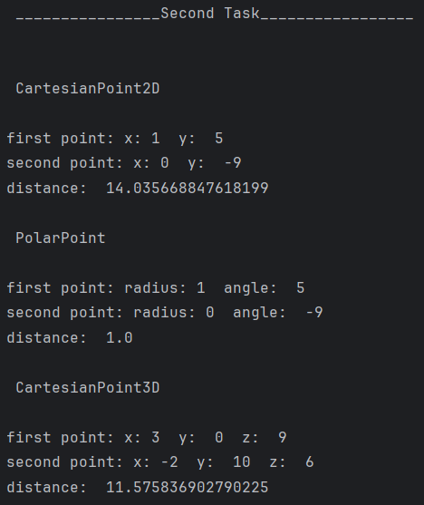
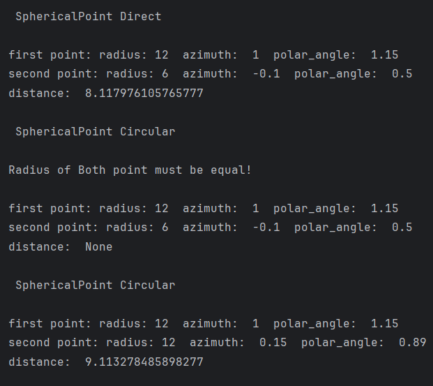

<h2 align='center'>Лабораторно-практичне заняття №1</h2>
<h4 align='right'>Вайцеховський Олександр</h4>
<h3>Тема: Програмні моделі систем координат</h3>
<h3>Мета роботи:</h3>
<ul>
  <li>Спроєктувати та реалізувати імутабельні програмні моделі для представлення точок у 2D та 3D системах координат;</li>
  <li>Реалізувати механізми перетворення між декартовою, полярною та сферичною системами координат з використанням статичних фабричних методів;</li>
  <li>Навчитись обчислювати відстані між точками, використовуючи різні математичні підходи.</li>
  <li>Провести аналіз продуктивності обчислень для різних представлень даних.</li>
</ul>
<h3>Опис класів</h3>
<h5> CartesianPoint2D </h5>  

```python  

class CartesianPoint2D:
    def __init__(self, x: float, y: float): #конструктор, приймає 2 параметри: цільночислові координати x та y
        self.__x = x
        self.__y = y

    @property
    def x(self): #параметр класу, метод доступу позв ним
        return self.__x

    @property
    def y(self): #параметр класу, метод доступу позв ним
        return self.__y

    @staticmethod #статичний метод конвертації об'єкта класу точки полярних координат у 2д декартову систему
    def from_polar(polar_point: "PolarPoint") -> "CartesianPoint2D":
        return CartesianPoint2D(polar_point.radius * math.cos(polar_point.angle),
                                polar_point.radius * math.sin(polar_point.angle))

    @staticmethod #статичний метод виміру дистанціїї між двома точками - об'єктами класу CartesianPoint2D
    def distance(first_point: "CartesianPoint2D", second_point: "CartesianPoint2D") -> float:
        return math.sqrt(pow((second_point.x - first_point.x),2)
                         + pow((second_point.y - first_point.y),2))

```  


<h5> PolarPoint </h5>  

```python  
class PolarPoint:
    def __init__(self, radius: float, angle: float): # конструктор, приймає 2 параметри: радіус (відстань від початку координат) та кут (в радіанах)
        self.__radius = radius
        self.__angle = angle
@property
def radius(self): # параметр класу, метод доступу до радіуса точки
    return self.__radius

@property
def angle(self): # параметр класу, метод доступу до кута точки
    return self.__angle

@staticmethod # статичний метод конвертації об'єкта класу декартової точки у полярну систему координат
def from_cartesian(cartesian_point: "CartesianPoint2D") -> "PolarPoint":
    return PolarPoint(math.sqrt(cartesian_point.x*cartesian_point.x + cartesian_point.y * cartesian_point.y),
                      math.atan2(cartesian_point.y, cartesian_point.x))

@staticmethod # статичний метод виміру відстані між двома точками в полярних координатах за теоремою косинусів
def distance(first_point: "PolarPoint", second_point: "PolarPoint") -> float:
    return math.sqrt(pow(second_point.radius, 2)
                     + pow(first_point.radius, 2)
                     - 2 * first_point.radius * second_point.radius * math.cos(second_point.angle - first_point.angle))

```  

<h5> CartesianPoint3D </h5>  

```python  
class CartesianPoint3D:
    def __init__(self, x: float, y: float, z: float): # конструктор, приймає 3 параметри: координати x, y та z у тривимірному просторі
        self.__x = x
        self.__y = y
        self.__z = z

    @property
    def x(self): # параметр класу, метод доступу до координати x
        return self.__x

    @property
    def y(self): # параметр класу, метод доступу до координати y
        return self.__y

    @property
    def z(self): # параметр класу, метод доступу до координати z
        return self.__z

    @staticmethod # статичний метод конвертації об'єкта класу сферичної точки у 3D декартову систему координат
    def from_spherical_point(spherical_point: "SphericalPoint") -> "CartesianPoint3D":
        return CartesianPoint3D(
            spherical_point.radius * math.sin(spherical_point.polar_angle) * math.cos(spherical_point.azimuth),
            spherical_point.radius * math.sin(spherical_point.polar_angle) * math.sin(spherical_point.azimuth),
            spherical_point.radius * math.cos(spherical_point.polar_angle)
        )

    @staticmethod # статичний метод виміру відстані між двома 3D точками за формулою евклідової відстані у тривимірному просторі
    def distance(first_point, second_point) -> float:
        return math.sqrt(pow((second_point.x - first_point.x), 2)
                         + pow((second_point.y - first_point.y), 2)
                         + pow((second_point.z - first_point.z), 2))
```  

<h5> SphericalPoint </h5>  

```python  
class SphericalPoint:
    def __init__(self, radius: float, azimuth: float, polar_angle: float): # конструктор, приймає 3 параметри: радіус (відстань від початку координат), азимут (кут в горизонтальній площині) та полярний кут (кут відносно вертикальної осі)
        self.__radius = radius
        self.__azimuth = azimuth
        self.__polar_angle = polar_angle
@property
def radius(self): # параметр класу, метод доступу до радіуса точки
    return self.__radius

@property
def azimuth(self): # параметр класу, метод доступу до азимута точки
    return self.__azimuth

@property
def polar_angle(self): # параметр класу, метод доступу до полярного кута точки
    return self.__polar_angle

@staticmethod # статичний метод конвертації об'єкта класу 3D декартової точки у сферичну систему координат
def from_cartesian_point(cartesian_point: "CartesianPoint3D") -> "SphericalPoint":
    cache_radius = math.sqrt(cartesian_point.x * cartesian_point.x
                             + cartesian_point.y * cartesian_point.y
                             + cartesian_point.z * cartesian_point.z)
    return SphericalPoint(
        cache_radius,
        math.atan2(cartesian_point.y, cartesian_point.x),
        math.atan2(cartesian_point.z, cache_radius)
    )

@staticmethod # статичний метод виміру прямої (евклідової) відстані між двома точками у сферичних координатах
def direct_distance(first_point: "SphericalPoint", second_point: "SphericalPoint") -> float:
    return(
        math.sqrt(abs(
            pow(first_point.radius, 2) + pow(second_point.radius, 2)
            - 2 * first_point.radius * second_point.radius * math.cos(first_point.polar_angle - second_point.polar_angle)
            + math.cos(first_point.azimuth) * math.cos(second_point.azimuth)
        ))
    )

@staticmethod # статичний метод виміру кругової (дугової) відстані між двома точками на сфері одного радіуса, повертає None якщо радіуси різні
def circular_distance(first_point: "SphericalPoint", second_point: "SphericalPoint") -> float | None:
    if first_point.radius != second_point.radius:
        print("Radius of Both point must be equal! \n")
        return None

    return(
        first_point.radius * math.acos(
        math.sin(first_point.polar_angle) * math.sin(second_point.polar_angle) *
        math.cos(first_point.azimuth - second_point.azimuth) +
        math.cos(first_point.polar_angle) * math.cos(second_point.polar_angle)
    )
    )
```
<h3>Інструкції дл компіляці</h3>  
<ul>
  <li>Встановити Python 3.12.6</li>
  <li>Завантажити у віртуально середовище Numpy: pip install numpy</li>
  <li>Запуск скрипта</li>
</ul>  
<h3>Перевірка коректності</h3>  
<p align="center">
	
</p>  
<h4 align='center'>Рисунок 3.1 - Перевірка правильності конвертації</h4>  
<p>Як можна побачити, із попровкою на похибку конвертації чисел з плаваючею точкою конвертація вірна</p>
<p align="center">
	
</p>  
<h4 align='center'>Рисунок 3.3 - Результати обчислень відстаней</h4>  
<p align="center">
	
</p>  
<h4 align='center'>Рисунок 3.3 - Результати обчислень відстаней</h4>  